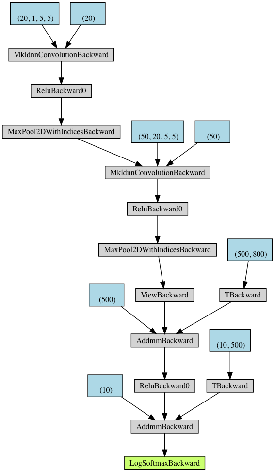
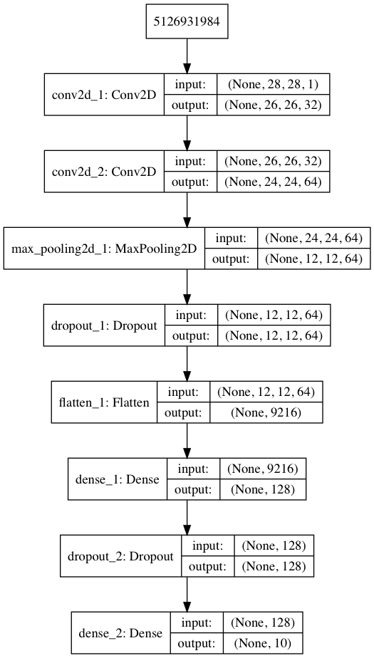
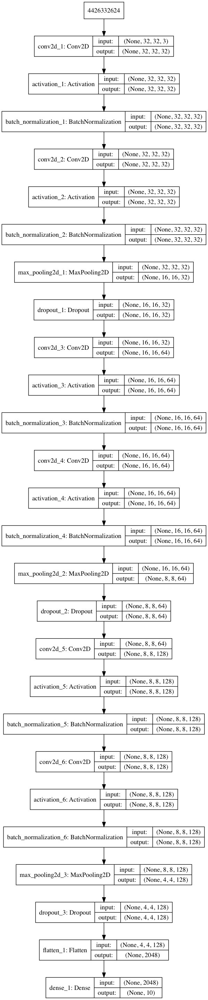

Description
-----------

This repository contains implementations of two convolutional neural networks (CNNs), 
one for the [CIFAR-10 dataset](https://www.cs.toronto.edu/~kriz/cifar.html) 
and one for the [MNIST dataset](http://yann.lecun.com/exdb/mnist/).
Both CNNs use the Keras API.  
Cached results are computed with TensorFlow backend. 
Note that TensorFlow versions >= 2.0 will throw deprecated software warnings.

The CIFAR-10 CNN includes 6 convolution layers and a flatten layer 
and is based on [this architecture](https://appliedmachinelearning.blog/2018/03/24/achieving-90-accuracy-in-object-recognition-task-on-cifar-10-dataset-with-keras-convolutional-neural-networks/) by Abhijeet Kumar.
This CNN achieves an accuracy of `89%`.

The MNIST CNN includes 2 convolution layers and a flatten layer 
and is based on [this architecture](https://github.com/keras-team/keras/blob/master/examples/mnist_cnn.py) from the Keras team.
This CNN achieves an accuracy of `99.2%`.

CNN Architectures
-----------------

<table border="0">
 <tr>
    <td><b style="font-size:30px">MNIST with PyTorch</b></td>
    <td><b style="font-size:30px">MNIST with Keras</b></td>
    <td><b style="font-size:30px">CIFAR-10 with Keras</b></td>
 </tr>
 <tr>
    <td>
      
    </td>
    <td>
      
    </td>
    <td>
      
    </td>
 </tr>
</table>

Demo Tutorial
-------------

* To run the demo, call the function `RunDemo.main(model_name=model_name, use_cached=use_cached)`. 

* `model_name` can take values `CIFAR`, `MNIST`, or `[]` (default).

* `use_cached` is boolean (default `True`).

Dependencies
------------

* `torch`, `torchvision`, `torchsummary`
* `graphviz`, `torchviz` 
* `keras`
* `TensorFlow`, `CNTK`, or `Theano`
